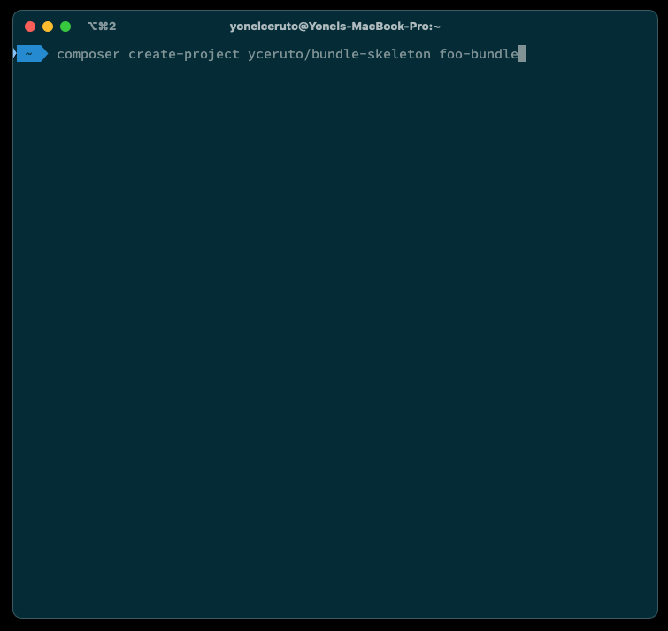

# Bundle Flex

Composer plugin for [Symfony Bundle Skeleton](https://github.com/yceruto/bundle-skeleton).

## Features

 - [x] Update `composer.json` file with PSR-4 namespaces.
 - [x] Generate `README.md` file with basic installation instructions.
 - [x] Generate directory structure and boilerplate files.
 - [x] Generate bundle class with basic implementation.

## License

This software is published under the [MIT License](LICENSE)
